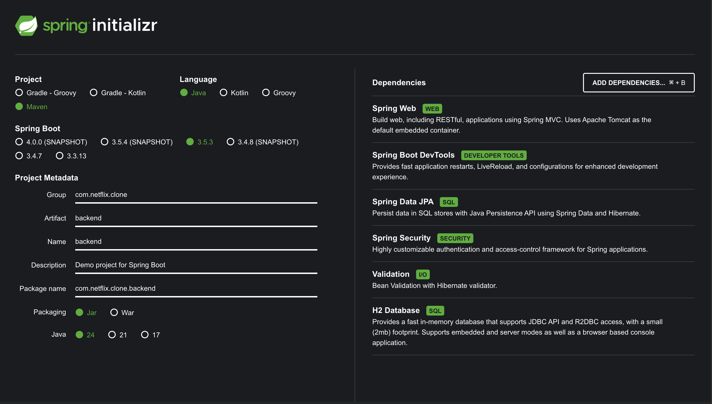

# Frontend

## 1. 초기 개발 세팅

- 다음 명령어로 frontend vite 프로젝트 생성.

```bash
 pnpm create vite frontend —template react-ts
```

- [shadcn/ui vite 설치 가이드](https://ui.shadcn.com/docs/installation/vite) 링크를 참고하여 tailwindcss + shadcn 설정.

## 2. prettier 설정

- 다음 명령어로 `eslint-config-prettier`를 설치한다.

```bash
  pnpm add -D eslint-config-prettier
```

- `eslint.config.js` 파일 맨 끝에 `eslintConfigPrettier` 를 추가한다.
- `.prettierrc.json` 파일을 만들고 포맷팅 규칙을 넣는다.

```json
{
  "arrowParens": "always",
  "bracketSpacing": true,
  "endOfLine": "lf",
  "htmlWhitespaceSensitivity": "css",
  "singleAttributePerLine": false,
  "bracketSameLine": false,
  "jsxSingleQuote": false,
  "printWidth": 80,
  "proseWrap": "preserve",
  "quoteProps": "as-needed",
  "semi": true,
  "singleQuote": false,
  "tabWidth": 2,
  "trailingComma": "all",
  "useTabs": false,
  "embeddedLanguageFormatting": "auto",
  "experimentalTernaries": false
}
```

## 3. eslint 추가 설정

- eslint-plugin-import와 eslint-import-resolver-typescript를 설치한다.

```bash
pnpm add -D eslint-plugin-import eslint-import-resolver-typescript
```

- `eslint.config.js` 에 하단의 코드를 추가한다

```json
{
    files: ["**/*.{ts,tsx}"],
    extends: [
      importPlugin.flatConfigs.recommended,
      importPlugin.flatConfigs.typescript,
    ],
    settings: {
      "import/resolver": {
        typescript: {
          project: "./tsconfig.json",
          alwaysTryTypes: true,
        },
        node: {
          extensions: [".js", ".jsx", ".ts", ".tsx"],
          paths: ["src"],
        },
      },
      "import/parsers": {
        "@typescript-eslint/parser": [".ts", ".tsx"],
      },
    },
    rules: {
      "no-unused-vars": "warn",
      "import/no-dynamic-require": "warn",
      "import/no-nodejs-modules": "warn",
      "import/order": [
        "error",
        {
          groups: [
            "builtin",
            "external",
            "internal",
            "parent",
            "sibling",
            "type",
          ],
          pathGroups: [{ pattern: "@/**", group: "internal" }],
          pathGroupsExcludedImportTypes: ["type"],
          alphabetize: {
            order: "asc",
            caseInsensitive: true,
          },
          "newlines-between": "always",
        },
      ],
    },
  },
  eslintConfigPrettier,
```

- `tsconfig.json` 의 경로 별칭을 인식하기 위해 `vite-tsconfig-paths` 를 설치한다.

```bash
pnpm add -D vite-tsconfig-paths
```

- `vite.config.ts` 를 다음과 같이 수정한다.

```json
export default defineConfig({
  plugins: [react(), tailwindcss(), tsconfigPaths()],
  resolve: {
    alias: {
      "@": path.resolve(__dirname, "./src"),
    },
  },
});

```

## 4. TailwindCSS

- `index.html`에서 title 하단에 `index.css`를 추가한다

```html
<title>Vite + React + TS</title> <link href="/src/index.css" rel="stylesheet" />
```

- 클래스명을 일관된 순서로 정렬하기 위해 prettier-plugin-tailwindcss 를 설치한다.

```bash
pnpm add -D prettier-plugin-tailwindcss
```

- `.prettierrc.json` 마지막에 plugins를 추가한다

```json
 "plugins": ["prettier-plugin-tailwindcss"]
```

# Backend

## 1. Spring Boot 프로젝트 생성

- [Spring Initializr](https://start.spring.io/) 에서 프로젝트를 생성
  
